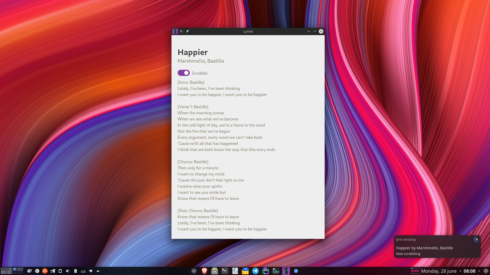
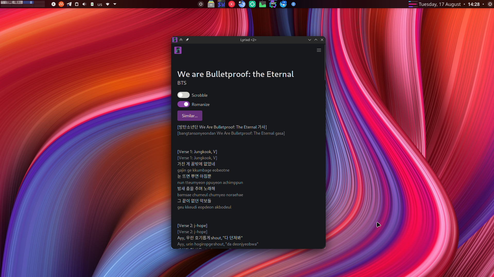

    

<h2 align="center">Lyrix Desktop</h2>

  

    A simple, tiny, powerful lyrics provider for desktop, built with Lyrix
     
    <a href="https://github.com/lyrix-music/cli/issues/new">Report bug</a>
    ·
    <a href="https://github.com/lyrix-music/cli/issues/new">Request feature</a>
  

Getting Started
---------------

The Lyrix desktop client is experimental, and is not yet ready 
for daily use. Early testers can get started by grabbing 
the desktop AppImage from [releases][lyrix-releases].

Double-click the AppImage and complete the login to start using
Lyrix right away.

License
-------
This [project][lyrix] is licensed under the MIT License.
See [LICENSE][license] for more information.

[lyrix]: https://github.com/lyrix-music/cli 
[lyrix-releases]: https://github.com/lyrix-music/cli/releases/tag/continuous
[license]: ./LICENSE
